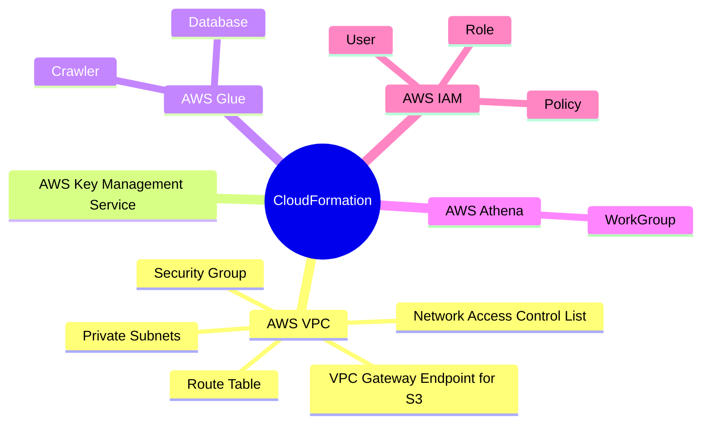
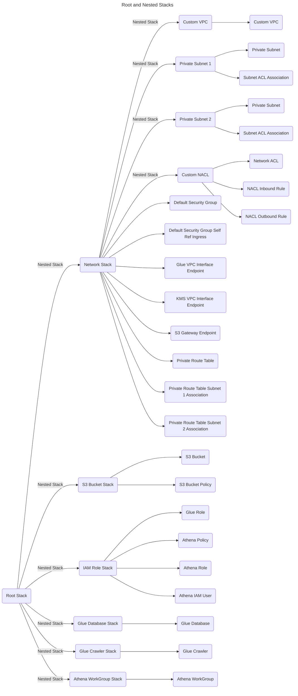

&nbsp;&nbsp;&nbsp;&nbsp;&nbsp;&nbsp;&nbsp;&nbsp;&nbsp;


# Project Agapanthus: Working with Glue Data Catalog and Running the Glue Crawler On Demand.

This project demonstrates how the AWS services - S3, Glue and Athena can be used to run analytics on data stored in S3 bucket in a secured environment. Security is enforced using AWS custom VPC, private subnets, VPC Endpoints, Identity and Access Management, Resource policy and Key Management service. The S3 bucket is strictly a private bucket which can be accessed only through VPC Gateway endpoint while Glue Crawlers runs in private subnets in a custom VPC. The S3 bucket policy prevents any operation from public internet and only allows upload of objects which are encrypted at rest using customer managed KMS Keys. Also the bucket policy ensures HTTPS is enforced for in-flight data transfer. Glue and KMS being public services are only accessible through VPC interface endpoints. Glue crawler is triggered manually to generate the metadata of CSV and JSON files stored in the raw S3 bucket. Then Athena is used to query the data only by the priviledged users having access to the custom WorkGroup. The entire stack is created using CloudFormation. User login credential is stored using AWS Secrets Manager.

## Description

A custom VPC houses the entire stack in a region of AWS Cloud. For this project, I am using US East 1 - North Virginia region, but any region can be used to create the resources. Two private subnets are created to ensure high availabiity. A S3 bucket is used to store the raw data which is only accessible from the private subnets enforced using S3 bucket policy. Glue crawler created to crawl the raw data to generate the metadata. The Glue Crawler and executed using manual run once the raw data is uploaded by the users. The S3 objects are encrypted using customer managed KMS key and preventing upload of unencrypted objects. Access of the bucket is restricted to only the private subnets and one custom IAM role and admin user. The Athena user is also grant read only access to the bucket in order to run analytics report by running SQL queries from Athena console..


### Services Used


# ***Prerequisites :***

## 1. Create a KMS Key or use an existing Key and update the Key policy by replacing the ***AWS Account Id***:
```json
{
    "Version": "2012-10-17",
    "Id": "key-consolepolicy-3",
    "Statement": [
        {
            "Sid": "Enable IAM User Permissions",
            "Effect": "Allow",
            "Principal": {
                "AWS": "arn:aws:iam::<AWS Account Id>:root"
            },
            "Action": "kms:*",
            "Resource": "*"
        },
        {
            "Sid": "Allow access for Key Administrators",
            "Effect": "Allow",
            "Principal": {
                "AWS": [
                    "arn:aws:iam::<AWS Account Id>:user/iamadmin",
                    "arn:aws:iam::<AWS Account Id>:role/OrganizationAccountAccessRole"
                ]
            },
            "Action": [
                "kms:Create*",
                "kms:Describe*",
                "kms:Enable*",
                "kms:List*",
                "kms:Put*",
                "kms:Update*",
                "kms:Revoke*",
                "kms:Disable*",
                "kms:Get*",
                "kms:Delete*",
                "kms:TagResource",
                "kms:UntagResource",
                "kms:ScheduleKeyDeletion",
                "kms:CancelKeyDeletion",
                "kms:RotateKeyOnDemand"
            ],
            "Resource": "*"
        },
        {
            "Sid": "Allow use of the key",
            "Effect": "Allow",
            "Principal": {
                "AWS": [
                    "arn:aws:iam::<AWS Account Id>:user/iamadmin",
                    "arn:aws:iam::<AWS Account Id>:role/OrganizationAccountAccessRole",
                    "arn:aws:iam::<AWS Account Id>:role/agapanthus-workgroup-role"
                ]
            },
            "Action": [
                "kms:Encrypt",
                "kms:Decrypt",
                "kms:ReEncrypt*",
                "kms:GenerateDataKey*",
                "kms:DescribeKey"
            ],
            "Resource": "*"
        },
        {
            "Sid": "Allow attachment of persistent resources",
            "Effect": "Allow",
            "Principal": {
                "AWS": [
                    "arn:aws:iam::<AWS Account Id>:user/iamadmin",
                    "arn:aws:iam::<AWS Account Id>:role/OrganizationAccountAccessRole"
                ]
            },
            "Action": [
                "kms:CreateGrant",
                "kms:ListGrants",
                "kms:RevokeGrant"
            ],
            "Resource": "*",
            "Condition": {
                "Bool": {
                    "kms:GrantIsForAWSResource": "true"
                }
            }
        },
        {
            "Sid": "Allowed services to use the encryption key",
            "Effect": "Allow",
            "Principal": {
                "Service": "s3.amazonaws.com"
            },
            "Action": [
                "kms:GenerateDataKey",
                "kms:Decrypt"
            ],
            "Resource": "*"
        }
    ]
}
```
## 2. Create a secret to store the IAM admin user password, which will be usd to create the athena user.


## Root stack launching the child stacks to create the necessary resources:




# ***Resource Walkthrough :***

## 1. S3 Bucket and Bucket Policy 

```jsonc
{
    "Version": "2012-10-17",
    "Statement": [
       // Bucket policy statement to enforce AWS KMS encryption
        {
            "Sid": "Deny-unless-SSE-KMS-encrypiton",
            "Effect": "Deny",
            "Principal": "*",
            "Action": "s3:PutObject",
            "Resource": "arn:aws:s3:::agapanthus-landing-zone-devl-us-east-1/*",
            "Condition": {
                "StringNotEqualsIfExists": {
                    "s3:x-amz-server-side-encryption": "aws:kms"
                },
                "Null": {
                    "s3:x-amz-server-side-encryption": "false"
                }
            }
        },
        // Bucket policy statement to enforce using a particular KMS key 
        {
            "Sid": "Deny-unless-SSE-KMS-KeyId",
            "Effect": "Deny",
            "Principal": "*",
            "Action": "s3:PutObject",
            "Resource": "arn:aws:s3:::agapanthus-landing-zone-devl-us-east-1/*",
            "Condition": {
                "StringNotEqualsIfExists": {
                    "s3:x-amz-server-side-encryption-aws-kms-key-id": "arn:aws:kms:us-east-1:637423502513:key/494509e4-3bc5-44b8-9c4d-12449900d395"
                }
            }
        },
        // Bucket policy statement to enforce HTTPS for inflight data transfer
        {
            "Sid": "EnforceInFlightObjectEncryption",
            "Effect": "Deny",
            "Principal": "*",
            "Action": "s3:PutObject",
            "Resource": "arn:aws:s3:::agapanthus-landing-zone-devl-us-east-1/*",
            "Condition": {
                "Bool": {
                    "aws:SecureTransport": "false"
                }
            }
        },
        // Bucket policy statement to enforce the bucket to be accessable via S3 Gateway Endpoint Id only
        // Condition contains the Canonical Id of the allowed user and roles which can access the bucket from S3 console
        // CLI Command reference:
        // 1. IAM User
        // aws iam get-user --user-name <User Name>
        // aws iam get-role --role-name <Role Name>
        {
            "Sid": "S3-Security-Deny-unless-VPC-endpoint",
            "Effect": "Deny",
            "Principal": "*",
            "Action": "s3:GetObject",
            "Resource": "arn:aws:s3:::agapanthus-landing-zone-devl-us-east-1/*",
            "Condition": {
                "StringNotLike": {
                    "aws:userId": [
                        "AROAZI2LGYSYVERBCCHGO:*",
                        "AROAZI2LGYSY3MGOOZD75:*",
                        "AROAZI2LGYSYVKL4XJGIN:*",
                        "AIDAZI2LGYSY7WDKOVKYW"
                    ]
                },
                "StringNotEquals": {
                    "aws:sourceVpce": "vpce-033a0b15c3e7ae69f"
                }
            }
        }
    ]
}

```

## 2. Glue Database 


## 3. Glue Crawler


## 4. Glue IAM Role


```jsonc
{
    "Version": "2012-10-17",
    "Statement": [
        {
            "Action": [
                "s3:GetObject"
            ],
            "Resource": "arn:aws:s3:::agapanthus-landing-zone-devl-us-east-1/*",
            "Effect": "Allow"
        },
        {
            "Action": [
                "kms:Encrypt",
                "kms:Decrypt",
                "kms:GenerateDataKey*"
            ],
            "Resource": "arn:aws:kms:us-east-1:637423502513:key/494509e4-3bc5-44b8-9c4d-12449900d395",
            "Effect": "Allow"
        }
    ]
}
```

## 5. Athena WorkGroup


## 5. Athena IAM User


## 6. Athena IAM User Assume Role


```jsonc
// Athena assume role policy grants required access to the IAM user "athena"
{
    "Version": "2012-10-17",
    "Statement": [
        {
            "Action": [
                "athena:ListWorkGroups",
                "athena:GetWorkGroup"
            ],
            "Resource": "*",
            "Effect": "Allow",
            "Sid": "WorkGroups"
        },
        {
            "Action": [
                "athena:StartQueryExecution",
                "athena:StopQueryExecution",
                "athena:BatchGetQueryExecution",
                "athena:GetQueryExecution",
                "athena:ListQueryExecutions",
                "athena:GetQueryResults",
                "athena:GetQueryResultsStream",
                "athena:CreateNamedQuery",
                "athena:GetNamedQuery",
                "athena:BatchGetNamedQuery",
                "athena:ListNamedQueries",
                "athena:DeleteNamedQuery",
                "athena:CreatePreparedStatement",
                "athena:GetPreparedStatement",
                "athena:ListPreparedStatements",
                "athena:UpdatePreparedStatement",
                "athena:DeletePreparedStatement"
            ],
            "Resource": "arn:aws:athena:us-east-1:637423502513:workgroup/agapanthus-workgroup-devl-us-east-1",
            "Effect": "Allow",
            "Sid": "Athena"
        },
        {
            "Action": [
                "glue:GetDatabases",
                "glue:GetTable*"
            ],
            "Resource": "*",
            "Effect": "Allow",
            "Sid": "Glue"
        },
        {
            "Action": [
                "s3:AbortMultipartUpload",
                "s3:GetBucketLocation",
                "s3:GetObject",
                "s3:ListBucket",
                "s3:ListMultipartUploadParts",
                "s3:PutObject"
            ],
            "Resource": [
                "arn:aws:s3:::agapanthus-landing-zone-devl-us-east-1",
                "arn:aws:s3:::agapanthus-landing-zone-devl-us-east-1/*"
            ],
            "Effect": "Allow",
            "Sid": "S3"
        }
    ]
}
```

# ***Running the Glue Crawler and querying the data in Athena :***

## 1. Upload the source data to the S3 landing zone bucket.


## 2. Run the Glue crawler on-demand.


## 3. Metadata generated for the source csv and json objects.


## 4. Login as "athena" IAM user, who don't have any access by default.


## 5. Switch role and execute the query in Athena.


## Help

:email: Subhamay Bhattacharyya - [subhamay.aws@gmail.com]

## Authors

Contributors names and contact info

Subhamay Bhattacharyya - [subhamay.aws@gmail.com]

## Version History

- 0.1
  - Initial Release

## License

This project is licensed under Subhamay Bhattacharyya. All Rights Reserved.

## Acknowledgments
